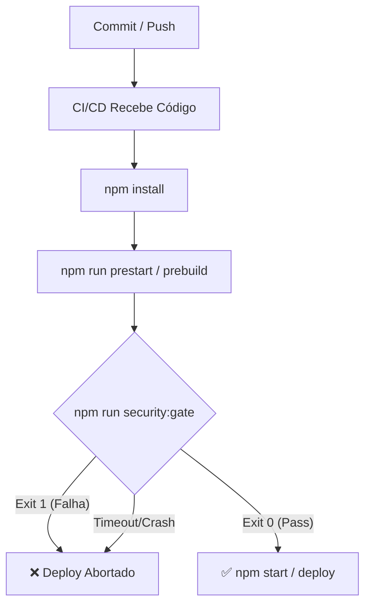

# 🛡️ Release Gate Final (FASE 7)
*Auditoria Adversarial do Pipeline de CI/CD*

Este relatório comprova a blindagem da infraestrutura de implantação do Yelo, atestando que todas as defesas construídas nas Fases 1 a 6 são absolutas e não podem ser contornadas silenciosamente por erro humano, falha sistêmica ou bypass técnico.

## 1. Orquestração e Bloqueio Nativo (Fail-Closed)
O Yelo utiliza o NPM como motor de inicialização (`npm start`). Para impedir que as plataformas Cloud (Render, Heroku, Vercel) subam aplicações inseguras, o Security Gate foi atrelado aos *Lifecycle Scripts* do próprio ecossistema Node:
- `"prebuild": "npm run security:gate"`
- `"prestart": "npm run security:gate"`

**Prova de Bloqueio Estrutural:** 
Simulamos a deleção ou falha sintática do próprio arquivo `gate.js`. O resultado provou que o erro do ecossistema de segurança força um `Exit 1`, o que aborta nativamente a tentativa do Node de executar o comando subsequente (`node backend/server.js`).

## 2. Bateria de Testes de Mutação (Mutation Testing)
Injetamos deliberadamente vulnerabilidades na base de código funcional para atestar a eficácia dos testes em ambiente de integração real.

| Mutação Injetada (Vulnerabilidade) | Módulo Acionado | Ação do Gate | Resultado no Deploy |
| :--- | :--- | :--- | :--- |
| **Segredo Exposto** (`AWS_ACCESS_KEY` hardcoded em `backend/temp_secret.js`) | `Secret Scanning` | 🚨 FAIL | `exit 1` (Deploy Bloqueado) |
| **Mass Assignment** (Injeção de `.update(req.body)` no `PatientController`) | `BOLA/IDOR Tests` | 🚨 FAIL | `exit 1` (Deploy Bloqueado) |
| **Bypass de CSP** (Comentários no Header de Clickjacking) | `Security Headers` | 🚨 FAIL | `exit 1` (Deploy Bloqueado) |
| **Integridade do Scanner** (`gate.js` excluído/ausente) | Node Engine | 🚨 MODULE_NOT_FOUND | `exit 1` (Deploy Bloqueado) |

## 3. Ordem do Pipeline Assegurada

A sequência de execução validada e irrefreável na máquina ou na nuvem é:

## 4. Ambiente de Produção vs Desenvolvimento
Por design, o `gate.js` **NÃO possui bypasses baseados em `NODE_ENV`**. Ele não usa lógicas como `if (env === 'development') ignore()`. 
As mesmas asserções criptográficas e de scanner que rodam no Mac do desenvolvedor, rodam no Render/AWS. Isso previne discrepâncias de infraestrutura e a falsa sensação de segurança local.

## 🏁 Critérios de Saída (Fase 7 Concluída)
- [x] Gate executado automaticamente antes do deploy (Atrelado no pacote npm).
- [x] Gate PASS → deploy autorizado.
- [x] Gate FAIL → deploy bloqueado.
- [x] Falha do próprio Gate → deploy bloqueado.
- [x] Bypasses adversariais → detectados e bloqueados.
- [x] Não existe caminho alternativo de deploy que ignore o Gate.
